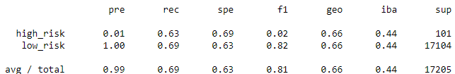
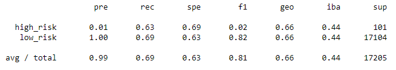
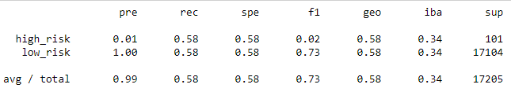
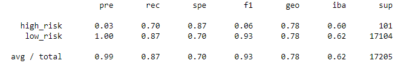
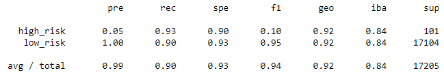

# Credit_Risk_Analysis
Supervised Machine Learning to Determine Credit Risk

## Overview
The purpose of this analysis was to run six different models to predict credit risk. We resampled and fit the data and then looked at the balanced accuracy score, precision score, and recall scores of all six models.

## Results
#### Naive Random Oversampling
* As you can see below, for high_risk, the precision is 0.01 and recall is 0.69. Neither of which are great scores, but the recall is decent. Also, the f1 score of 0.02 does not imply this is a good algorithm. Here is the Classification Report:

#### SMOTE Oversampling
* As you can see below, for high_risk, the precision is 0.01 and recall is 0.63. Neither of which are good scores. Also, the f1 score of 0.02 does not imply this is a good algorithm. Here is the Classification Report:

#### Undersampling
* As you can see below, for high_risk, the precision is 0.01 and recall is 0.58. Neither of which are good scores. Also, the f1 score of 0.02 does not imply this is a good algorithm. Here is the Classification Report:

#### Combination (Over/Under) Sampling
* As you can see below, for high_risk, the precision is 0.01 and recall is 0.72. Neither of which are great scores, but the recall is good. Also, the f1 score of 0.02 does not imply this is a good algorithm. Here is the Classification Report:

#### Balanced Random Forest
* As you can see below, for high_risk, the precision is 0.03 and recall is 0.70. Neither of which are great scored, but the recall is good. Also, the f1 score of 0.06 does not imply this is a good algorithm. Here is the Classification Report:

#### Easy Ensemble AdaBoost Classifier
* As you can see below, for high_risk, the precision is 0.05 and recall is 0.93. Here, the recall score is very good. Also, the f1 score of 0.06 is not high, but it is higher than the rest. Here is the Classification Report:

## Summary
From these six models, none of them have a high precision or f1 score. However, I would argue that precision and f1 score are not nearly as important when determining credit risk. If someone is predicted as a false positive, it is not nearly as risky as a false negative and actually hand out a loan to them. Therefore, I would argue that recall is the most important measure here and I would recommend the Easy Ensemble AdaBoost Classifier as the algorithm to use.
